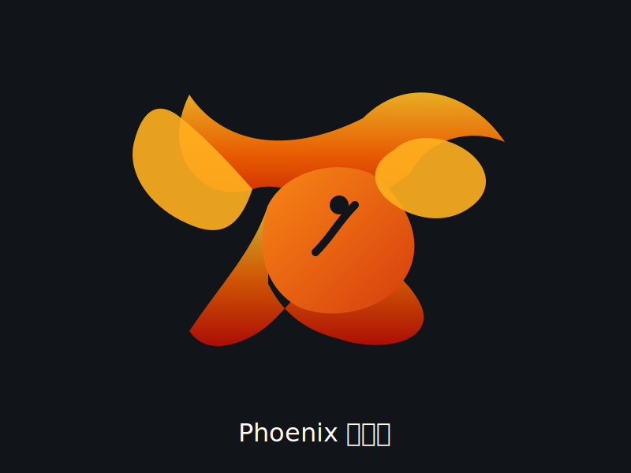

# AI Agent 자동화 개발자 과정 6조

## 🔥 피닉스(Pheonix)

우리 불사신 6조 팀은 강력한 AI 에이전트를 개발합니다.

### 팀 소개
- 팀명: **피닉스(Pheonix)**
- 목표: **자기 복원과 확장 가능한 AI 에이전트 개발**
- 슬로건: **우리 불사신 6조, AI 에이전트의 미래를 만들어갑니다!**

### 팀원
- 박석호
- 오상영
- 송종현
- 김병기

### 프로젝트 방향
- **AI 에이전트 설계 및 구축**
- **자동화 워크플로우 최적화**
- **데이터 기반 학습과 지능형 의사결정**
- **신뢰성 있는 에이전트 운영 및 확장성 확보**

### 기대 효과
- 혁신적인 자동화 솔루션 제공
- 빠른 적응력과 자기 개선 능력 보유
- 다양한 업무 환경에서 유연하게 활용 가능

> 앞으로 AI-Agent-Team-Six와 함께 성장하는 여정에 많은 관심 부탁드립니다.
